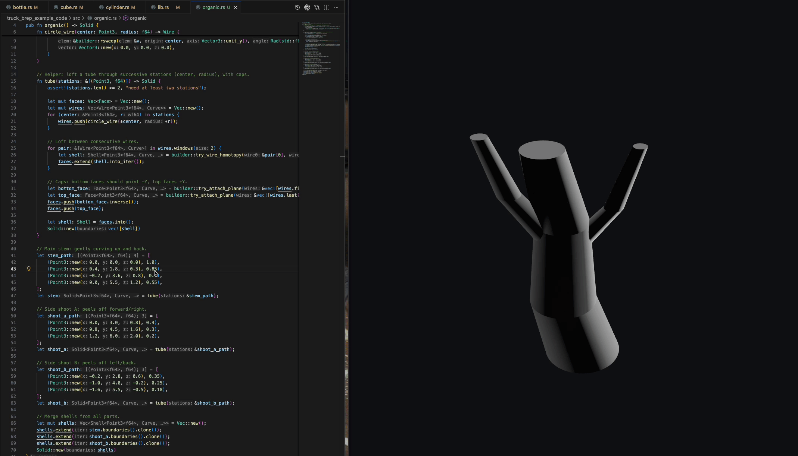
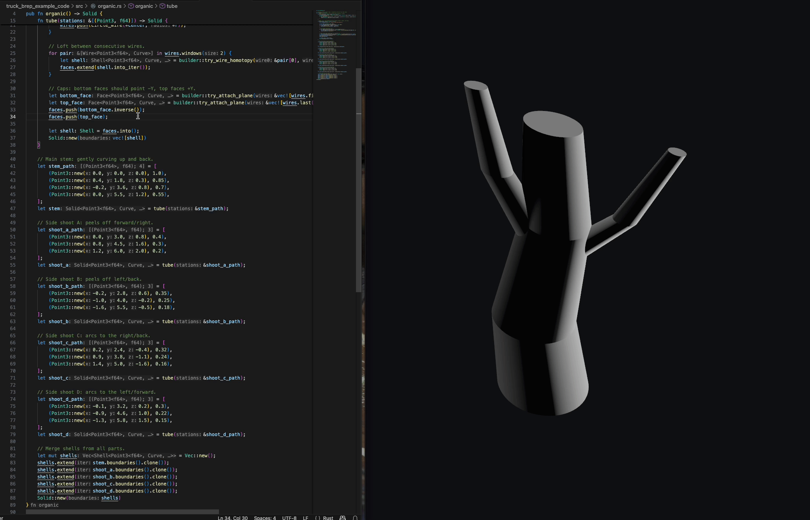

# truck_viz workspace

Combined workspace with two crates:
- `truck_brep_example_code`: generates sample geometry files.
- `truck_viewer`: Bevy viewer for the generated assets.

## Prerequisites
- Rust toolchain (stable) with `cargo`.

## Setup after cloning
1) Create the symlink so the viewer sees generated assets:
   ```sh
   cd truck_viz
   ln -s ../truck_brep_example_code/output truck_viewer/assets
   ```
   On Windows without symlink support, copy or set up a directory junction instead (e.g., `mklink /J truck_viewer\\assets ..\\truck_brep_example_code\\output` from an elevated cmd).
   If the symlink already exists, you can recreate it with `ln -sfn ...`.

2) Generate some geometry (writes into `truck_brep_example_code/output/`):
   ```sh
   cd truck_brep_example_code
   cargo run --example bottle   # writes bottle.gltf/obj/bin/step
   cargo run --example cube     # writes cube.gltf/obj/bin/step
   ```

3) Run the viewer with asset hot-reload:
   ```sh
   cd ../truck_viewer
   BEVY_ASSET_WATCHER=poll cargo run
   ```
   The viewer loads a GLTF named in `truck_viewer/src/lib.rs` (default: `cube.gltf`). Change that filename if you want to view a different export.





## Notes
- Generated assets (`output/`, `truck_viewer/assets`) are gitignored; re-run the examples after fresh clones.
- Hot-reload watches the `assets/` directory (the symlink) when `BEVY_ASSET_WATCHER=poll` is set. Edits to GLTF/OBJ/etc. will reload at runtime.***
